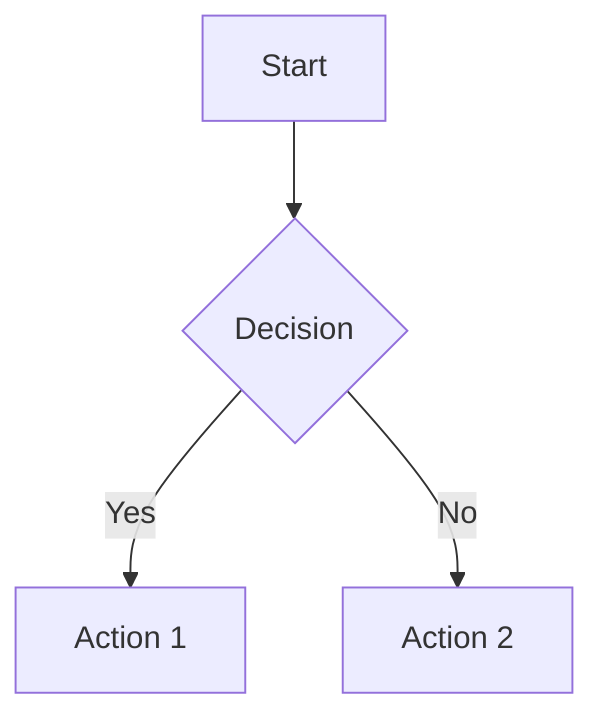

# Markdown Preview Usage Guide

## Overview
Enhanced markdown editing experience with real-time browser preview, syntax highlighting, and advanced features like math rendering and diagrams.

## Plugin: markdown-preview.nvim
Using the most popular and feature-rich markdown preview plugin for Neovim.

## Features
- **Real-time Preview**: Updates as you type
- **Synchronized Scrolling**: Preview follows your cursor position
- **Math Support**: KaTeX rendering for mathematical equations
- **Diagrams**: Mermaid, PlantUML, flowcharts, sequence diagrams
- **Code Highlighting**: Syntax highlighting for code blocks
- **Dark/Light Themes**: Configurable appearance
- **Local Images**: Preview images from your filesystem
- **Table of Contents**: Auto-generated navigation
- **Task Lists**: Interactive checkboxes
- **Emoji Support**: GitHub-style emoji rendering

## Installation Requirements
- **Node.js**: Required for the preview server
- **Modern Browser**: Chrome, Firefox, Safari, Edge
- The plugin will auto-install dependencies on first use

## Commands

### Basic Commands
- `:MarkdownPreview` - Start preview in browser
- `:MarkdownPreviewStop` - Stop preview server
- `:MarkdownPreviewToggle` - Toggle preview on/off

### Key Mappings
- `<leader>mp` - Start Markdown Preview
- `<leader>ms` - Stop Markdown Preview
- `<leader>mt` - Toggle Markdown Preview

## Usage Examples

### 1. Basic Workflow
```bash
# Create or open a markdown file
nvim document.md

# Start preview
<leader>mp
# OR
:MarkdownPreview
```

### 2. Real-time Editing
- Type in Neovim - preview updates instantly
- Scroll in Neovim - preview scrolls synchronously
- Add images, tables, code blocks - see immediate results

### 3. Math and Diagrams
```markdown
# Math equations
$E = mc^2$

$$
\int_{-\infty}^{\infty} e^{-x^2} dx = \sqrt{\pi}
$$

# Mermaid diagrams


### 4. Code Documentation
Perfect for:
- API documentation
- README files
- Technical notes
- Project documentation
- Database schema documentation

## Configuration

### Current Settings
- **Auto-start**: Disabled (manual start with `<leader>mp`)
- **Auto-close**: Enabled (closes when switching buffers)
- **Real-time**: Enabled (updates as you type)
- **Theme**: Dark theme
- **Sync scroll**: Enabled
- **Math**: KaTeX enabled
- **Diagrams**: Mermaid, PlantUML enabled

### Buffer Options (Auto-applied)
When opening markdown files:
- Word wrap enabled
- Line break enabled
- Spell check enabled
- Concealment level 2 (hides markup for cleaner editing)

## Integration with Your Workflow

### Documentation Workflow
1. **Database Docs**: Document your SQL schemas and queries
2. **Project Notes**: Technical specifications and designs
3. **Meeting Notes**: Real-time collaborative editing
4. **API Docs**: Interactive documentation with code examples

### Content Creation
- **Blog Posts**: Preview exactly how content will look
- **Reports**: Professional formatting with tables and charts
- **Presentations**: Slide-like markdown with live preview

## Tips and Best Practices

### Performance
- **Large Files**: Preview handles large documents well
- **Images**: Use relative paths for portability
- **Real-time**: Disable auto-refresh for very large files if needed

### Organization
- Use headers for clear document structure
- Leverage TOC for navigation
- Use task lists for project tracking

### Collaboration
- Preview helps ensure formatting is correct
- Math and diagrams render consistently
- Share browser preview URL for team reviews

## Troubleshooting

### Preview Not Opening
1. Check Node.js is installed: `node --version`
2. Manually start: `:MarkdownPreview`
3. Check browser popup blockers
4. Try different browser

### Sync Issues
- Restart preview: `<leader>ms` then `<leader>mp`
- Check cursor position in editor
- Verify scroll sync is enabled

### Math Not Rendering
- Ensure KaTeX is enabled in configuration
- Check math syntax (use `$` for inline, `$$` for blocks)
- Restart preview if needed

### Images Not Showing
- Use relative paths from markdown file location
- Check file exists and permissions
- Supported formats: PNG, JPG, GIF, SVG

## Alternative: peek.nvim

If you prefer a lighter alternative:
1. Enable `peek.nvim` in the configuration
2. Disable `markdown-preview.nvim`
3. Requires Deno instead of Node.js
4. Commands: `:PeekOpen`, `:PeekClose`
5. Keymaps: `<leader>po`, `<leader>pc`

## Advanced Features

### Custom CSS
- Add custom styling to preview
- Configure themes and colors
- Brand documentation with company styles

### Network Preview
- Share preview URL with team members
- Remote editing capabilities
- Collaborative review sessions

### Export Options
- Print from browser for PDF export
- Save HTML for web publishing
- Copy formatted content for other platforms

This setup transforms Neovim into a powerful markdown authoring environment with professional preview capabilities!